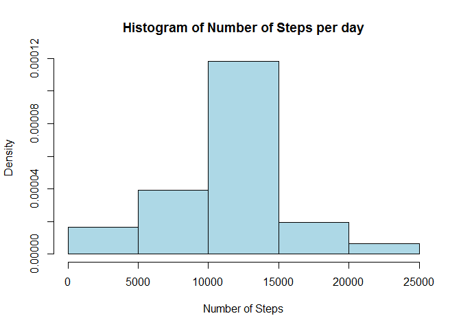

# Reproducible Research: Peer Assessment 1


## Loading and preprocessing the data

Set working directory to correct path

```r
setwd("~/DataScience/Git/RepData_PeerAssessment1")
```

and load the data from the *activity.zip* file into an object *activityData*.
Convert dates using *as.Date()* function.


```r
activityData<-read.csv(unz("activity.zip", "activity.csv"))
activityData$date<-as.Date(activityData$date)
```

## What is mean total number of steps taken per day?

First we split the *activityData* dataset by day


```r
dayData<-split(activityData,activityData$date)
```

and now we compute the mean steps by each day and return it.


```r
daySteps<-sapply(dayData,function(x){sum(x$steps,na.rm=T)})
daySteps
```

```
## 2012-10-01 2012-10-02 2012-10-03 2012-10-04 2012-10-05 2012-10-06 
##          0        126      11352      12116      13294      15420 
## 2012-10-07 2012-10-08 2012-10-09 2012-10-10 2012-10-11 2012-10-12 
##      11015          0      12811       9900      10304      17382 
## 2012-10-13 2012-10-14 2012-10-15 2012-10-16 2012-10-17 2012-10-18 
##      12426      15098      10139      15084      13452      10056 
## 2012-10-19 2012-10-20 2012-10-21 2012-10-22 2012-10-23 2012-10-24 
##      11829      10395       8821      13460       8918       8355 
## 2012-10-25 2012-10-26 2012-10-27 2012-10-28 2012-10-29 2012-10-30 
##       2492       6778      10119      11458       5018       9819 
## 2012-10-31 2012-11-01 2012-11-02 2012-11-03 2012-11-04 2012-11-05 
##      15414          0      10600      10571          0      10439 
## 2012-11-06 2012-11-07 2012-11-08 2012-11-09 2012-11-10 2012-11-11 
##       8334      12883       3219          0          0      12608 
## 2012-11-12 2012-11-13 2012-11-14 2012-11-15 2012-11-16 2012-11-17 
##      10765       7336          0         41       5441      14339 
## 2012-11-18 2012-11-19 2012-11-20 2012-11-21 2012-11-22 2012-11-23 
##      15110       8841       4472      12787      20427      21194 
## 2012-11-24 2012-11-25 2012-11-26 2012-11-27 2012-11-28 2012-11-29 
##      14478      11834      11162      13646      10183       7047 
## 2012-11-30 
##          0
```

Now we plot a histogram of the data in *daySteps*


```r
hist(daySteps,main="Histogram of Number of Steps per day",
     xlab="Number of Steps",freq=F,col="lightblue")
```

<!-- -->

And finally we report the mean and median of the number of steps per day


```r
sapply(dayData,function(x){summary(x$steps,na.rm=T)[3:4]})
```

```
##        2012-10-01 2012-10-02 2012-10-03 2012-10-04 2012-10-05 2012-10-06
## Median         NA     0.0000       0.00       0.00       0.00       0.00
## Mean          NaN     0.4375      39.42      42.07      46.16      53.54
##        2012-10-07 2012-10-08 2012-10-09 2012-10-10 2012-10-11 2012-10-12
## Median       0.00         NA       0.00       0.00       0.00       0.00
## Mean        38.25        NaN      44.48      34.38      35.78      60.35
##        2012-10-13 2012-10-14 2012-10-15 2012-10-16 2012-10-17 2012-10-18
## Median       0.00       0.00        0.0       0.00       0.00       0.00
## Mean        43.15      52.42       35.2      52.38      46.71      34.92
##        2012-10-19 2012-10-20 2012-10-21 2012-10-22 2012-10-23 2012-10-24
## Median       0.00       0.00       0.00       0.00       0.00       0.00
## Mean        41.07      36.09      30.63      46.74      30.97      29.01
##        2012-10-25 2012-10-26 2012-10-27 2012-10-28 2012-10-29 2012-10-30
## Median      0.000       0.00       0.00       0.00       0.00       0.00
## Mean        8.653      23.53      35.14      39.78      17.42      34.09
##        2012-10-31 2012-11-01 2012-11-02 2012-11-03 2012-11-04 2012-11-05
## Median       0.00         NA       0.00        0.0         NA       0.00
## Mean        53.52        NaN      36.81       36.7        NaN      36.25
##        2012-11-06 2012-11-07 2012-11-08 2012-11-09 2012-11-10 2012-11-11
## Median       0.00       0.00       0.00         NA         NA       0.00
## Mean        28.94      44.73      11.18        NaN        NaN      43.78
##        2012-11-12 2012-11-13 2012-11-14 2012-11-15 2012-11-16 2012-11-17
## Median       0.00       0.00         NA     0.0000       0.00       0.00
## Mean        37.38      25.47        NaN     0.1424      18.89      49.79
##        2012-11-18 2012-11-19 2012-11-20 2012-11-21 2012-11-22 2012-11-23
## Median       0.00        0.0       0.00        0.0       0.00       0.00
## Mean        52.47       30.7      15.53       44.4      70.93      73.59
##        2012-11-24 2012-11-25 2012-11-26 2012-11-27 2012-11-28 2012-11-29
## Median       0.00       0.00       0.00       0.00       0.00       0.00
## Mean        50.27      41.09      38.76      47.38      35.36      24.47
##        2012-11-30
## Median         NA
## Mean          NaN
```

## What is the average daily activity pattern?

To answer that question first we are going to compute the average number of
steps taken for each 5-min interval over all days and then plot the resulting
time series


```r
intData<-split(activityData,activityData$interval)
intSteps<-sapply(intData,function(x){mean(x$steps,na.rm=T)})
plot(names(intSteps),intSteps,type="l",xlab="5-min interval",ylab="Mean steps",
     main="Time series of mean number of steps for 
     each 5-min time interval across all days")
```

<!-- -->

We are also reporting the 5-min time interval with the highest mean number of
steps across all days.


```r
names(intSteps)[which(intSteps==max(intSteps))]
```

```
## [1] "835"
```

## Imputing missing values

We have noted that there are several values coded as *NA* indicating the 
presence of missing values in the *steps* variable. First we are going to
compute how many missing values do we have


```r
sum(is.na(activityData$steps))
```

```
## [1] 2304
```

We are going to fill all the missing values using the mean of the 5-min
interval in the new data frame *noNAData*.


```r
df<-data.frame(interval=names(intSteps),mean=intSteps)
merged<-merge(activityData,df,by="interval")
merged[is.na(merged$steps),]$steps<-merged[is.na(merged$steps),]$mean
ordered<-merged[order(merged$date,merged$interval,decreasing=F),]
noNAData<-data.frame(steps=ordered$steps,date=ordered$date,interval=ordered$interval)
```

Now with this new dataset we are going to compute the mean number of steps per
day and plot a histogram and report the mean and median too to compare with the
values obtained when there was missing data in the data set.


```r
dayData2<-split(noNAData,noNAData$date)
daySteps2<-sapply(dayData2,function(x){sum(x$steps)})
hist(daySteps2,main="Histogram of Number of Steps per day",
     xlab="Number of Steps",freq=F,col="lightblue")
```

<!-- -->

```r
sapply(dayData2,function(x){summary(x$steps)[3:4]})
```

```
##        2012-10-01 2012-10-02 2012-10-03 2012-10-04 2012-10-05 2012-10-06
## Median      34.11     0.0000       0.00       0.00       0.00       0.00
## Mean        37.38     0.4375      39.42      42.07      46.16      53.54
##        2012-10-07 2012-10-08 2012-10-09 2012-10-10 2012-10-11 2012-10-12
## Median       0.00      34.11       0.00       0.00       0.00       0.00
## Mean        38.25      37.38      44.48      34.38      35.78      60.35
##        2012-10-13 2012-10-14 2012-10-15 2012-10-16 2012-10-17 2012-10-18
## Median       0.00       0.00        0.0       0.00       0.00       0.00
## Mean        43.15      52.42       35.2      52.38      46.71      34.92
##        2012-10-19 2012-10-20 2012-10-21 2012-10-22 2012-10-23 2012-10-24
## Median       0.00       0.00       0.00       0.00       0.00       0.00
## Mean        41.07      36.09      30.63      46.74      30.97      29.01
##        2012-10-25 2012-10-26 2012-10-27 2012-10-28 2012-10-29 2012-10-30
## Median      0.000       0.00       0.00       0.00       0.00       0.00
## Mean        8.653      23.53      35.14      39.78      17.42      34.09
##        2012-10-31 2012-11-01 2012-11-02 2012-11-03 2012-11-04 2012-11-05
## Median       0.00      34.11       0.00        0.0      34.11       0.00
## Mean        53.52      37.38      36.81       36.7      37.38      36.25
##        2012-11-06 2012-11-07 2012-11-08 2012-11-09 2012-11-10 2012-11-11
## Median       0.00       0.00       0.00      34.11      34.11       0.00
## Mean        28.94      44.73      11.18      37.38      37.38      43.78
##        2012-11-12 2012-11-13 2012-11-14 2012-11-15 2012-11-16 2012-11-17
## Median       0.00       0.00      34.11     0.0000       0.00       0.00
## Mean        37.38      25.47      37.38     0.1424      18.89      49.79
##        2012-11-18 2012-11-19 2012-11-20 2012-11-21 2012-11-22 2012-11-23
## Median       0.00        0.0       0.00        0.0       0.00       0.00
## Mean        52.47       30.7      15.53       44.4      70.93      73.59
##        2012-11-24 2012-11-25 2012-11-26 2012-11-27 2012-11-28 2012-11-29
## Median       0.00       0.00       0.00       0.00       0.00       0.00
## Mean        50.27      41.09      38.76      47.38      35.36      24.47
##        2012-11-30
## Median      34.11
## Mean        37.38
```

We can see how imputting the NA values has made that some of the most extreme
values in the 0-5000 bin have moved to the central 10000-15000 bin.

## Are there differences in activity patterns between weekdays and weekends?

To study the differences between weekdays and weekends we are going to add a 
factor variable to out *noNAData* dataset to account for that difference.


```r
library(lubridate)
noNAData$dayfactor<-as.factor(ifelse(wday(noNAData$date)==7 | 
                                 wday(noNAData$date)==1,"weekend","weekday"))
```

Now we will plot the average number of steps taken for each 5-min interval 
over all weekdays and weekends.


```r
dayfactorData<-split(noNAData,noNAData$dayfactor)
dayfactorwdayData<-dayfactorData$weekday
dayfactorwendData<-dayfactorData$weekend
splitwdayData<-split(dayfactorwdayData,dayfactorwdayData$interval)
splitwendData<-split(dayfactorwendData,dayfactorwendData$interval)
meanStepswday<-sapply(splitwdayData,function(x){mean(x$steps)})
meanStepswend<-sapply(splitwendData,function(x){mean(x$steps)})

min.width=trunc(min(as.numeric(names(meanStepswday)),
                    as.numeric(names(meanStepswend))))
max.width=ceiling(max(as.numeric(names(meanStepswday)),
                    as.numeric(names(meanStepswend))))
min.length=trunc(min(meanStepswday,meanStepswend))
max.length=ceiling(max(meanStepswday,meanStepswend))
par(mfrow=c(2,1))
par(cex = 0.6)
par(mar = c(0, 0, 0, 0), oma = c(4, 4, 0.5, 2))
par(tcl = -0.25)
par(mgp = c(2, 0.6, 0))
plot(names(meanStepswday),meanStepswday,type="l",xlab="",ylab="",axes=FALSE,
     xlim=c(min.width,max.width),ylim=c(min.length,max.length))
mtext("Weekdays",side=3,line=-1,adj = 0.1, cex = 0.6)
axis(4, at = seq(min.length, max.length, length.out=4))
box()
plot(names(meanStepswend),meanStepswend,type="l",xlab="",ylab="",axes=FALSE,
     xlim=c(min.width,max.width),ylim=c(min.length,max.length),)
mtext("Weekends",side=3,line=-1,adj = 0.1, cex = 0.6)
axis(2, at = seq(min.length, max.length, length.out=4))
axis(1, at = seq(min.width, max.width, length.out=4))
box()
mtext("5-min interval", side=1, outer=T, at=0.5,cex = 0.7, line = 2.2)
mtext("Mean steps", side=2, outer=T, at=0.5,cex = 0.7, line = 2.2)
```

<!-- -->
